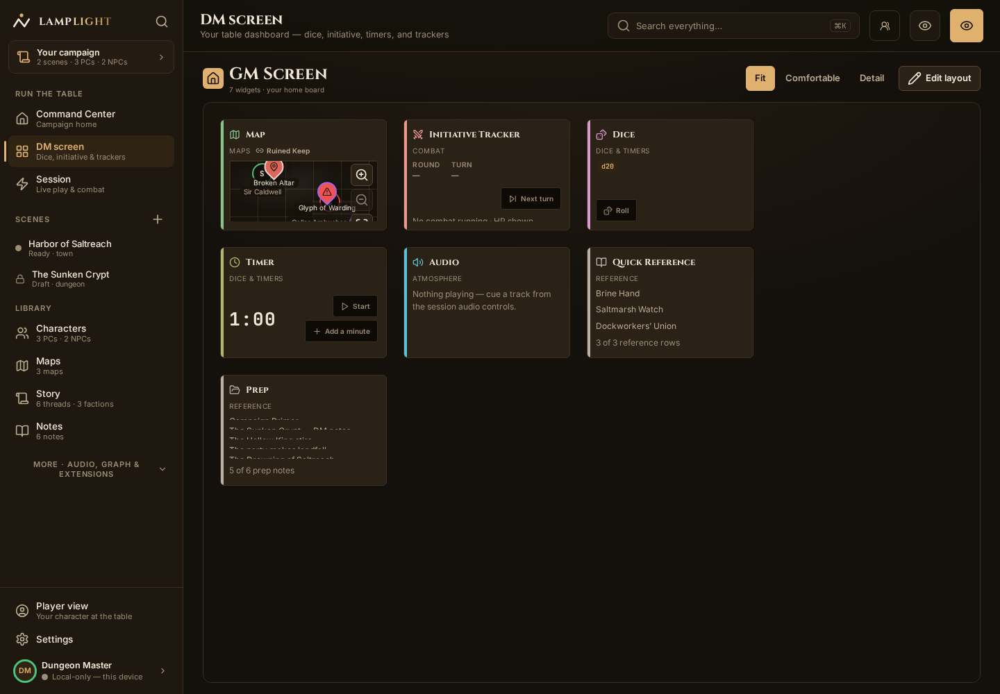
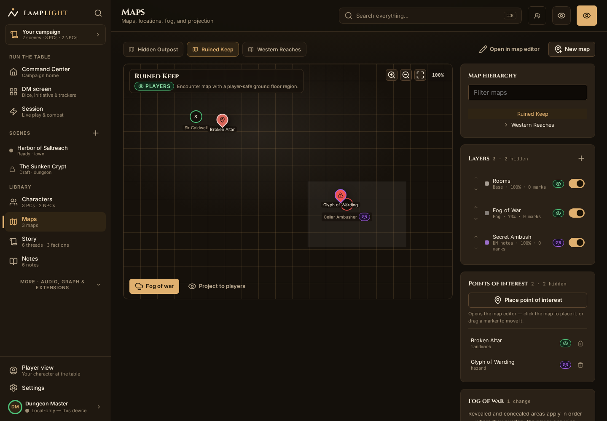

# Lamplight

Lamplight is a workspace for running tabletop RPGs. Keep campaign notes beside your maps,
arrange session tools on a board, and track the party through a fight. Your vault lives on your
device; cloud services are optional.

The app is in alpha, with a release candidate in development. Start with the
[install guide](apps/gm-react/INSTALL-ALPHA.md) for desktop and Android downloads, setup, and
platform limits. Export a vault backup before upgrading. See the [release notes](CHANGELOG.md)
for changes and the [project site](https://lamplight.click) for the web app.

## At the table



Arrange widgets on the board to keep session tools within reach.



The atlas brings maps and points of interest into the campaign. Reveal fog and move tokens during play.

These are real captures of the built-in sample vault from the RC development build, refreshed on
2026-09-12. [Capture details and refresh command](infra/web-hosting/README.md#screenshots).

## Work on Lamplight

This repository is a pnpm workspace:

```text
apps/gm-react/       @dndtools/gm-react — the GM app (Vite + React 18) with Electron desktop and
                     Capacitor Android shells, LAN and cloud remote play, and the installable web app
packages/core/       @dndtools/core     — the framework-free processing core (commands, reducers,
                     permissions, queries, schemas, registries)
packages/cloud-fns/  @dndtools/cloud-fns — Lambda handlers for signaling, E2EE sync, app-api, billing
infra/               AWS SAM stacks for the opt-in cloud backend
docs/                architecture, decisions, design, development, runbooks, planning, security
scripts/, tests/     workspace tooling, gates, the validate harness, repo guardrail tests
tools/loop/          the autonomous RC loop's roadmap parser and prompts
archive/gm-svelte/   the retired SvelteKit app (tag svelte-gm-final); not built
```

Start at [`docs/README.md`](docs/README.md). Setup and standards are in
[`docs/development/DEVELOPMENT.md`](docs/development/DEVELOPMENT.md); the alpha install guide for
end users is [`apps/gm-react/INSTALL-ALPHA.md`](apps/gm-react/INSTALL-ALPHA.md).

## Commands

```bash
pnpm install
pnpm dev              # React app on :5273
pnpm build            # core, cloud functions, then the app
pnpm typecheck
pnpm test             # core + cloud + app + tooling unit suites
pnpm e2e              # Playwright on desktop and mobile Chromium
pnpm a11y:gate        # contrast lints + axe gate
pnpm lint             # eslint + boundary lint + contrast lint
pnpm check            # Android preflight + gates + boundary lint + typecheck + tests
pnpm validate         # whole-application harness
pnpm desktop:dev      # Electron shell against the dev server
```

## Boundaries

- `@dndtools/core` imports no React, DOM, Node, Electron, Capacitor, or cloud code. Enforced by
  `scripts/boundary-lint.ts`.
- The app owns rendering, platform services, transport, and command dispatch; every durable change
  flows through a command into the core, and every read is actor-scoped so players never see
  DM-private content.
- Browser, Electron, and Android consume one `PlatformCapabilities` contract; native code stays
  under `apps/gm-react/electron` and `apps/gm-react/android`.

The v1 document editor is preserved at tag `v1-final`; the SvelteKit remake at `svelte-gm-final`.
