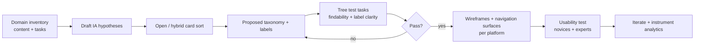

# Modern Cross‑Platform UX Design Best Practices for Mobile, Web, and Desktop

## Executive summary

Designing one application to feel “native enough” across mobile, web, and desktop is primarily a navigation and information‑architecture (IA) problem, not a visual‑polish problem. Users succeed fastest when (a) the top‑level structure matches their mental model, (b) the most important information and actions are consistently “prevalent” (easy to notice and reach), and (c) the product teaches itself through progressive disclosure, contextual help, and strong empty states instead of relying on long tours. These principles are repeatedly reinforced in modern platform design systems (Apple HIG, Material Design, Microsoft’s Fluent/Windows guidance), IA research practices (card sorting and tree testing), and usability research on wayfinding, information scent, and onboarding. citeturn5search0turn3search10turn4search3turn5search3turn2search11

Because your request does not specify the app’s domain (e.g., finance vs. creative tool vs. logistics), user segments (novice vs. expert), or content model (document‑centric vs. object‑centric vs. workflow‑centric), this report treats the target as a “complex tool” with multiple primary areas, deep content, and a meaningful learning curve. Where detail is inherently product‑specific (taxonomy, roles, permissions, offline strategy), the report provides decision frameworks and measurable criteria rather than a single universal answer. citeturn21search0turn19search1turn4search3turn5search5

Key takeaways you can apply immediately:

- **Pick a stable “north‑star IA” first**, then map it into platform‑appropriate navigation surfaces (tabs/bottom bar, sidebars/rails, left/top navigation, menu bar) rather than inventing a different structure per platform. Use card sorting to shape the structure and tree testing to validate findability before UI polish. citeturn5search0turn3search10turn18search6turn18search1turn2search0
- **Optimise for information scent and label clarity**: users choose paths based on cues from labels and surrounding context; unclear labels or hidden menus drive failure. Keep navigation in expected locations and avoid hiding primary navigation on large screens. citeturn4search3turn5search5
- **Teach by doing**: onboarding should help users reach first value quickly, while contextual help remains available later (because tours are often forgotten and can interrupt). Empty states are a major learnability lever for new tools—treat them as “in‑product training surfaces.” citeturn2search2turn5search3turn2search11
- **Accessibility is not a checklist bolt‑on**: core navigation, dialogs, forms, and input methods must work with keyboard, assistive tech, reduced motion, and touch alternatives. WCAG 2.2 adds new requirements around focus visibility and “dragging movements,” which directly affect modern gesture‑heavy UI patterns. citeturn0search2turn0search4turn7search2turn24search17

## Platform conventions and cross‑platform strategy

A practical cross‑platform strategy is to keep **concepts and IA consistent** while letting **surfaces and interaction details** follow platform conventions (e.g., tab bar vs. navigation rail vs. left nav). This is explicitly supported by modern guidance on adaptive navigation, layout, and controls from platform owners. citeturn18search6turn18search1turn2search0turn8search11

### Table comparing platform conventions and key differences

| Dimension                     | iOS                                                                                                                                   | Android                                                                                                                                                                            | Web (major browsers)                                                                                  | Windows                                                                            | macOS                                                                                            |
| ----------------------------- | ------------------------------------------------------------------------------------------------------------------------------------- | ---------------------------------------------------------------------------------------------------------------------------------------------------------------------------------- | ----------------------------------------------------------------------------------------------------- | ---------------------------------------------------------------------------------- | ------------------------------------------------------------------------------------------------ |
| Primary top‑level navigation  | Tab bars for top‑level sections; sidebars often preferred for complex structures (esp. iPad/Mac); adaptive/convertible patterns exist | Navigation bar (bottom) for 3–5 destinations; navigation rail for larger layouts; drawers historically common but evolving guidance de‑emphasises them in newer Material 3 updates | Typically top or left navigation; users expect browser back/forward and visible nav at desktop widths | NavigationView supports left/top patterns; can adapt top → left at narrower widths | Sidebars + toolbars; global menu bar for top‑level menus/commands                                |
| Back navigation               | In‑app back + platform gestures (e.g., swipe), but app must still provide clear hierarchy                                             | System back is central; in‑app back behaviour must align with system expectations                                                                                                  | Browser back is primary; avoid breaking it with SPA routing without history integration               | Back button patterns exist; keyboard and windowing expectations are strong         | Back navigation exists, but many flows rely more on sidebar/context and menu bar discoverability |
| Discoverability of commands   | Toolbars, menus, contextual actions; avoid clutter; progressive disclosure                                                            | Visible primary actions, contextual actions; predictable placement                                                                                                                 | Visible controls + keyboard shortcuts (if “app‑like”); searchable UI helps                            | Command bars, menus, accelerators (keyboard shortcuts)                             | Menu bar is a major locus for discoverability + shortcuts                                        |
| Keyboard as first‑class input | Increasingly relevant on iPad/Mac; standard shortcuts help transfer learning                                                          | Large screens guidance expects keyboard/mouse/trackpad support for productivity                                                                                                    | Must support full keyboard navigation for accessibility; shortcuts improve efficiency                 | Accelerators and access keys are common conventions                                | Strong keyboard culture; menu bar and shortcuts key to expert workflows                          |
| Layout adaptation approach    | Adaptive layouts and navigation patterns across device classes                                                                        | Material window size classes guide layout decisions; tablet/foldable/desktop contexts                                                                                              | Responsive design via CSS and adaptable patterns; respect user prefs (motion)                         | Responsive and adaptive patterns; XAML supports fluid layouts and visual states    | Window resizing + sidebar/toolbar patterns; density often more adjustable                        |

Sources: Apple HIG on tab bars/sidebars/layout/menu bar/keyboard guidance citeturn9search17turn18search2turn18search6turn9search0turn13search0, Material navigation + window size classes guidance citeturn0search19turn0search6turn18search1turn0search8, Windows NavigationView and responsive design techniques citeturn2search0turn18search3, Android large‑screen keyboard/mouse guidance citeturn13search1turn13search22.

## Navigation, information prevalence, and organization

This section is intentionally deep, because for multi‑platform “tools,” navigation and information organisation determine learnability, speed, and perceived quality more than any single visual style choice. Recent standards work in the ISO 9241 series explicitly treats interaction principles, information presentation, and navigation design as foundational to usability, reinforcing that these are not “taste” issues. citeturn21search0turn22search0turn19search1

image_group{"layout":"carousel","aspect_ratio":"16:9","query":["iOS tab bar Human Interface Guidelines example","Material Design 3 navigation rail example","Windows NavigationView left navigation example WinUI","macOS app sidebar toolbar example"] ,"num_per_query":1}

### Navigation architecture model to use across platforms

A robust cross‑platform navigation model usually has three layers:

- **Global navigation**: moves between the app’s primary areas (few, stable, always available).
- **Local navigation**: moves within an area (filters, sub‑sections, tabs, in‑page anchors).
- **Contextual navigation**: object‑to‑object or workflow jumps (related items, breadcrumbs, “Go to…”).

This structure aligns with platform patterns: tab bars / navigation bars and sidebars are global; tabs and segmented controls are local; breadcrumbs and related links are contextual. citeturn9search17turn18search2turn0search19turn0search6turn26view0

```mermaid
flowchart TD
  A[Global navigation\nTop-level areas] --> B[Local navigation\nWithin-area structure]
  B --> C[Content & objects\nLists, documents, entities]
  C --> D[Contextual navigation\nRelated items, breadcrumbs,\n"Open in...", deep links]
  D --> C
  B --> E[Help & learnability layer\nInline hints, empty states,\ncontextual help, shortcuts]
  E --> B
```

The practical implication: you can maintain one IA while offering different global surfaces per device class (tabs on small screens, sidebar/rail on large screens), as encouraged by adaptive navigation guidance (e.g., convertible patterns). citeturn18search6turn18search9turn18search1turn2search0

### Designing information prevalence

“Information prevalence” (what stands out and what is easy to reach) is created by a combination of hierarchy, spacing/density, and cue strength:

- **Visual hierarchy**: prominence from scale, contrast, grouping, and positioning. citeturn4search7turn18search6
- **Layout density**: tuning spacing to show more or less information without losing comprehension; modern Material guidance treats density as a first‑class lever. citeturn4search1turn18search1
- **Information scent**: users choose where to go based on the cues in labels and surrounding context; the “scent” of a navigation option is largely label quality + context. citeturn4search3turn5search5

Concrete prevalence rules that hold across platforms:

- Put the **primary task and primary object** of the screen in the most visually prominent region (top of content area, left in LTR locales) and limit competing emphasis. citeturn4search7turn4search6turn18search0
- Keep **global navigation and system status** consistently located and styled; don’t force users to “hunt” for wayfinding cues. citeturn5search5turn2search0
- Prefer **recognition over recall**: visible, well‑labelled navigation and actions outperform hidden menus for basic wayfinding (and are easier for new users). citeturn5search5turn0search19turn9search17

### IA methods that reduce navigation risk

Because your app targets multiple platforms, IA mistakes are amplified: you pay the cost in every client. The most consistently recommended workflow is:

- **Card sorting** to learn how users group concepts (mental models) and to draft candidate category structures and labels. citeturn5search0
- **Tree testing** to evaluate findability of items in a proposed hierarchy (labels + structure) before UI design. citeturn3search10
- **Menu design guidelines** to ensure visibility, expected placement, and scannability—especially that hiding navigation on larger screens is rarely justified. citeturn5search5

A rigorous IA workflow looks like this:



This is directly aligned with NN/g’s framing of card sorting (mental models) and tree testing (findability evaluation). citeturn5search0turn3search10turn5search11

### Optimising learning a new tool

For complex applications, learnability is improved less by “telling” and more by **layering capability** and embedding help safely into the UI.

Evidence‑supported tactics:

- **Progressive disclosure**: defer advanced or rare features so the default UI is easier to learn and less error‑prone; keep power features accessible through secondary surfaces (menus, advanced panels, “More” sections). citeturn1search1turn1search18
- **Prefer contextual help over long tutorials**: onboarding tutorials can interrupt users and are quickly forgotten; contextual help avoids this but must be visible and easy to activate. citeturn5search3
- **Design empty states as a “first lesson”**: empty states can communicate status, drive first actions, and increase learnability (feature discovery + guidance). citeturn2search11turn2search3
- **Make search part of navigation**: search fields and search scope must be clear (what is being searched), and search should support the IA instead of compensating for it. citeturn9search6turn9search1turn9search5
- **Keyboard shortcuts and discoverability**: standard shortcuts help transfer learning across apps; on large‑screen Android and Apple platforms, guidance expects serious keyboard support, and helper surfaces can improve discoverability. citeturn13search0turn13search1turn13search22turn13search2

A practical “learnability system” for a new tool typically includes:

- **First‑run: minimal** (what value is, what permissions mean, where the main areas are), consistent with platform onboarding guidance. citeturn2search2turn6search0turn6search9
- **In‑flow coaching**: hints that trigger only when relevant (first time a user reaches a screen, or when they fail a task) rather than constant “tips.” citeturn5search3turn2search11
- **Persistent help entry points**: “?” menu/help centre, keyboard shortcut cheat sheet, and contextual “learn more” near complex controls. citeturn5search3turn13search0turn13search22

## Layout, input, and interaction patterns

Cross‑platform success requires designing interaction to the **capabilities of the input device** (touch, pointer, keyboard, pen) and the **constraints of screen size and windowing** (phone vs tablet vs resizable desktop window). Guidance across web, Android, Windows, and Apple platforms increasingly converges on adaptive/responsive systems rather than “one fixed layout.” citeturn18search0turn18search11turn18search3turn18search6

### Responsive vs adaptive layout decisions

- Web guidance frames responsive design as using fluid layouts with media queries and encourages breakpoints based on content needs rather than specific device models. citeturn18search0turn18search4turn18search17
- Material defines window size classes (compact→extra‑large) for designing layouts that scale across form factors, and Android’s Compose guidance maps to that approach (with added classes for desktop/connected displays). citeturn18search1turn18search11
- Windows distinguishes responsive (fluid) vs adaptive (replacing layout) patterns and provides techniques for XAML apps to reflow and replace UI at different window sizes. citeturn18search3turn18search16
- Apple explicitly supports adaptive navigation patterns (e.g., choosing between tab bar and sidebar patterns depending on device context), including updated guidance and APIs for modern iPad navigation. citeturn18search6turn18search15turn18search12

Practical layout rules:

- Treat small screens as “single primary pane”; reveal secondary panes (filters, details, related items) progressively on medium+ layouts. citeturn18search1turn18search6turn18search3
- Avoid re‑architecting the IA at different sizes; instead, change **presentation** (e.g., sidebar becomes tab bar) while keeping destinations consistent. citeturn18search6turn18search9turn2search0

### Input modalities: touch vs pointer vs keyboard vs pen

On modern platforms you should assume users may switch input modes on the same device (touch + keyboard on tablets, mouse + trackpad + touch on 2‑in‑1s). Web standards explicitly define unified pointer input so developers can support mouse, touch, and pen/stylus without separate event models. citeturn6search3

Cross‑platform interaction principles:

- **Never make core functionality depend on a single interaction** (e.g., drag only, gesture only). Apple accessibility guidance explicitly calls for alternatives to gestures, and WCAG 2.2 adds requirements for alternatives to dragging movements. citeturn13search13turn0search4turn0search2
- **Keyboard support** should include logical focus order, full operation, and productivity shortcuts where the tool is complex. Apple emphasises standard shortcuts to help people transfer knowledge; Android large‑screen guidance calls out keyboard, mouse and trackpad capabilities; Windows provides dedicated accelerator guidance. citeturn13search0turn13search1turn13search2turn13search10
- For complex widgets on the web, follow WAI‑ARIA Authoring Practices patterns for keyboard interaction and semantics (menus, tabs, tree views). citeturn25view0turn25view1turn26view1turn26view2

## Accessibility and inclusive UX

WCAG 2.2 is the current W3C Recommendation for web accessibility and adds new success criteria that directly affect modern UI (focus visibility, target size, dragging alternatives, consistent help, redundant entry, accessible authentication). Even if your native apps are not legally assessed under WCAG in every jurisdiction, mapping your cross‑platform design system to WCAG dramatically reduces risk and improves usability for keyboard and assistive tech users. citeturn0search2turn0search4turn24search17

### Accessibility checklist mapped to WCAG 2.1 and 2.2

The table below lists high‑impact criteria for app UX (navigation, learnability, forms, dialogs, motion). It is not a substitute for the full standard but is a practical build checklist.

| WCAG principle | Success criteria (most relevant to apps)                                                                                                                          | Practical UX implementation checklist                                                                                                                                                                                                                                                                                       |
| -------------- | ----------------------------------------------------------------------------------------------------------------------------------------------------------------- | --------------------------------------------------------------------------------------------------------------------------------------------------------------------------------------------------------------------------------------------------------------------------------------------------------------------------- |
| Perceivable    | 1.3.1 Info and Relationships; 1.4.3 Contrast (Minimum); 1.4.10 Reflow; 1.4.11 Non‑text Contrast                                                                   | Use semantic structure and programmatic relationships (labels, groups, headings). Ensure text contrast meets minimums; ensure UI components/focus indicators have sufficient contrast; ensure layouts reflow without loss of content or functionality. citeturn0search2turn7search3turn4search6                        |
| Operable       | 2.1.1 Keyboard; 2.4.3 Focus Order; 2.4.7 Focus Visible; 2.4.11/2.4.12 Focus Not Obscured (2.2); 2.5.7 Dragging Movements (2.2); 2.5.8 Target Size (Minimum) (2.2) | Everything works with keyboard only; focus order matches task flow; focus is always visible and not hidden by sticky headers/footers; provide tap/click alternatives to drag gestures; meet minimum target sizing and spacing (especially on touch). citeturn0search2turn0search4turn7search2turn25view1turn6search3 |
| Understandable | 3.2.6 Consistent Help (2.2); 3.3.1 Error Identification; 3.3.3 Error Suggestion; 3.3.7 Redundant Entry (2.2); 3.3.8 Accessible Authentication (2.2)               | Keep help access in a consistent location; errors are identified in text and linked to fields; provide suggestions and examples; don’t force repeated data entry when it can be re‑used; don’t prevent password managers/auto‑fill or require puzzle‑like auth. citeturn0search4turn24search2turn24search17            |
| Robust         | 4.1.2 Name, Role, Value; ARIA Authoring Practices                                                                                                                 | For web components, ensure correct accessible names/roles/states and follow ARIA patterns for complex widgets (tabs, tree views, menus, dialogs). citeturn25view0turn25view2turn26view1turn26view2                                                                                                                    |

#### Special focus areas for your “new tool” learning use case

- **Dialogs and onboarding overlays**: “role=dialog” alone is insufficient; dialogs must be labelled and must manage focus correctly (move focus into the dialog, restore it on close). citeturn25view2
- **Tree navigation and complex sidebars**: distinguish focus vs selection clearly, and implement keyboard behaviour as specified in patterns. citeturn26view2
- **Motion and vestibular sensitivity**: honour reduced‑motion preferences (web: `prefers-reduced-motion`) and avoid relying on animation as the only feedback. citeturn7search2turn8search4turn8search2

## Delivery plan with checklists, patterns, testing, roadmap, and sources

This section contains the concrete artefacts you asked for: cross‑platform checklists, pattern recommendations with pros/cons and examples, a testing/metrics plan, an implementation roadmap, and an annotated bibliography.

### Detailed best‑practice checklist organised by topic and platform

The format below is “topic‑first” so teams can implement consistently while applying platform conventions where they differ.

| Topic                               | Cross‑platform baseline                                                                                           | iOS / iPadOS / macOS                                                                                       | Android                                                                                                  | Web                                                                          | Windows                                                                               |
| ----------------------------------- | ----------------------------------------------------------------------------------------------------------------- | ---------------------------------------------------------------------------------------------------------- | -------------------------------------------------------------------------------------------------------- | ---------------------------------------------------------------------------- | ------------------------------------------------------------------------------------- |
| Global navigation                   | 3–7 top‑level areas; always available; labels reflect user mental models; don’t hide primary nav on large screens | Prefer tab bar for simple top‑level areas; for complex IA, prefer sidebar or adaptive convertible patterns | Bottom nav for 3–5 primary destinations; rail for large layouts; be cautious with drawers as primary nav | Visible nav on desktop widths; integrate with browser history (back/forward) | Use NavigationView; consider top nav on large windows and left nav on smaller windows |
| Local navigation                    | Tabs/segmented controls for small sets; avoid deep nesting; keep within one “area”                                | Flatten complicated hierarchies with segmented controls where appropriate                                  | Use tabs or in‑content navigation; ensure touch + keyboard work                                          | Follow ARIA tab patterns and keyboard interactions                           | Use appropriate controls and keep hierarchy simple                                    |
| Contextual navigation               | Breadcrumbs for hierarchical contexts; related links; “open in…”                                                  | Use clear hierarchy cues and consistent back behaviour                                                     | Respect system back and deep‑link patterns                                                               | Implement breadcrumb semantics (`aria-current`)                              | Provide clear context and navigation history cues                                     |
| IA validation                       | Card sort → tree test → iterate                                                                                   | Use first‑class search and scope cues in Apple patterns                                                    | Use Material IA patterns + standard component placement                                                  | Validate labels and structure with findability tasks                         | Validate navigation structure early to avoid expensive rework                         |
| Information prevalence              | Strong hierarchy; density tuning; predictable grouping                                                            | Apple guidance emphasises hierarchy and layout clarity                                                     | Material density guidance and layout foundations                                                         | Responsive design; ensure consistent hierarchy across breakpoints            | Use spacing/type ramps to create hierarchy                                            |
| Learnability                        | Progressive disclosure; contextual help; empty states as training                                                 | Onboarding should teach app, not device; keep it short                                                     | Use empty/offline states intentionally; reinforce primary actions                                        | Keep help entries consistent; avoid intrusive tours                          | Support shortcuts and help surfaces for productivity                                  |
| Forms                               | Minimise cognitive load; labels not placeholders; clear errors + suggestions; avoid redundant entry               | Follow text field guidance; writing guidelines for clear labels                                            | Use Material text fields; inline validation                                                              | Follow WCAG input assistance (3.3.\*) + label semantics                      | Use labels; consider localisation; follow control guidance                            |
| Notifications                       | Ask consent in context; be conservative; allow user control                                                       | Consent required; notification patterns                                                                    | Use channels/categories and action clarity                                                               | Consider quieter permission UIs; be user‑initiated                           | Respect OS notification settings and user agency                                      |
| Internationalisation                | RTL support; text expansion; locale formats; language metadata                                                    | RTL guidance and localisation APIs                                                                         | RTL guidance; avoid hard‑coded direction                                                                 | Use W3C i18n techniques; language/direction metadata                         | Ensure layout adapts and strings localise correctly                                   |
| Performance & perceived performance | Fast initial response; clear progress; skeletons where appropriate; avoid jank                                    | Avoid blocking UI; keep transitions meaningful                                                             | Use appropriate loading states                                                                           | Meet Core Web Vitals; use perceived performance tactics                      | Manage loading and responsiveness; avoid layout churn                                 |

Sources for the table: Apple HIG navigation/layout/onboarding/search/RTL/text fields/notifications citeturn18search6turn9search17turn18search2turn2search2turn9search6turn14search1turn24search0turn10search0; Material navigation/density/window size classes/text fields/offline states citeturn0search19turn0search6turn0search8turn4search1turn18search1turn24search5turn15search0; Windows NavigationView/responsive design/content spacing/text box citeturn2search0turn18search3turn4search6turn24search3; Web standards WCAG/WAI‑ARIA/i18n/permissions/pointer events and guidance on responsive design/performance citeturn0search2turn25view0turn26view0turn14search4turn16search0turn6search3turn18search0turn7search1; IA methods (card sorting/tree testing) and navigation research citeturn5search0turn3search10turn5search5turn4search3.

### Recommended patterns and components with pros/cons and examples

| Pattern / component            | Best for                                                               | Trade‑offs and failure modes                                                             | Platform notes and links                                                                                                                                                  |
| ------------------------------ | ---------------------------------------------------------------------- | ---------------------------------------------------------------------------------------- | ------------------------------------------------------------------------------------------------------------------------------------------------------------------------- |
| Tab bar / bottom navigation    | Fast switching among primary areas; high discoverability               | Limited destinations; overcrowding reduces findability                                   | Apple tab bars guidance (keep top‑level) citeturn9search17turn0search0; Material navigation bar 3–5 destinations citeturn0search19                                 |
| Sidebar / navigation rail      | Complex IA; larger screens; persistent wayfinding                      | Consumes width; can become an unmanageable tree if not curated                           | Apple sidebars guidance (consider tab bar first; complex IA supports sidebar/adaptive) citeturn18search2turn18search6; Material nav rail guidance citeturn0search6 |
| Navigation drawer              | Large destination lists when space constrained                         | Hides options; increases “trial and error”; can hurt novice discoverability              | Material 3 updates de‑emphasise drawers in favour of rails/expanded patterns citeturn0search8turn0search6                                                             |
| Left nav / NavigationView      | Desktop apps with many areas; resizable windows                        | Requires careful grouping; deep nesting can overwhelm                                    | Windows NavigationView guidance (top→left adaptation) citeturn2search0                                                                                                 |
| Breadcrumbs                    | “Where am I?” in hierarchical content; quick jumps up                  | Not a replacement for primary nav; poor if hierarchy is not meaningful                   | WAI‑ARIA breadcrumb pattern + `aria-current` citeturn26view0                                                                                                           |
| Tabs                           | Switching among views within a single area                             | Too many tabs become mini‑navigation chaos; needs strong labels                          | WAI‑ARIA tabs pattern and keyboard behaviour citeturn26view1                                                                                                           |
| Tree view                      | Deep hierarchies (files, categories)                                   | Accessibility and keyboard behaviour are easy to get wrong; selection vs focus confusion | WAI‑ARIA tree view pattern notes focus vs selection citeturn26view2                                                                                                    |
| Search as navigation           | Large content sets; expert workflows; “command palette” stepping stone | Can mask poor IA if treated as primary fix; needs clear scope                            | Apple search scope guidance citeturn9search6; Material search component citeturn9search5; Fluent Searchbox citeturn9search11                                     |
| Contextual help / “What’s new” | Learnability without interruption                                      | Help must be visible and retrievable; avoid persistent nagging                           | Tutorials vs contextual help findings citeturn5search3                                                                                                                 |
| Empty states                   | First‑time guidance; feature discovery                                 | If too generic, wastes key moment                                                        | Empty states increase learnability and can provide pathways citeturn2search11turn2search3                                                                             |

#### Code and design examples

**Web: accessible global navigation + breadcrumb skeleton (semantic HTML first)**

```html
<a class="skip-link" href="#main">Skip to main content</a>

<header>
	<nav aria-label="Primary">
		<ul>
			<li><a href="/projects">Projects</a></li>
			<li><a href="/reports">Reports</a></li>
			<li><a href="/settings">Settings</a></li>
		</ul>
	</nav>
</header>

<nav aria-label="Breadcrumb">
	<ol>
		<li><a href="/projects">Projects</a></li>
		<li><a href="/projects/123">Project Alpha</a></li>
		<li><a aria-current="page" href="/projects/123/files">Files</a></li>
	</ol>
</nav>

<main id="main">
	<!-- page content -->
</main>
```

This illustrates the breadcrumb pattern expectation (`aria-current="page"`) and the use of navigation landmarks. citeturn26view0turn25view0

**SwiftUI: adaptive “tabs ↔ sidebar” plus split view for complex IA (conceptual example)**

```swift
import SwiftUI

struct RootView: View {
    var body: some View {
        TabView {
            NavigationSplitView {
                Sidebar()
            } detail: {
                ContentDetail()
            }
            .tabItem { Label("Work", systemImage: "folder") }

            SettingsView()
                .tabItem { Label("Settings", systemImage: "gearshape") }
        }
        // On supported platforms this can adapt to a sidebar-style appearance.
    }
}
```

This aligns with Apple’s modern guidance around tab navigation and split views for complex structures and adaptive navigation approaches. citeturn18search23turn0search18turn18search15

**Android (Compose): decide between nav bar and nav rail using window size class (conceptual example)**

```kotlin
@Composable
fun AppScaffold(windowSizeClass: WindowSizeClass) {
    when (windowSizeClass.widthSizeClass) {
        WindowWidthSizeClass.Compact -> {
            // NavigationBar (bottom) for primary destinations
        }
        else -> {
            // NavigationRail for larger layouts
        }
    }
}
```

This corresponds to Material window size classes and guidance that nav rail supports larger layouts and that window size classes are intended for high‑level layout decisions. citeturn18search1turn18search11turn0search6

**Windows (WinUI): NavigationView switching top → left at narrow widths (conceptual example)**

```xml
<NavigationView x:Name="Nav"
                PaneDisplayMode="Auto">
  <!-- items -->
</NavigationView>
```

Windows documentation explicitly recommends switching from top to left navigation on narrower windows to avoid collapsing everything into overflow. citeturn2search0

### Security, privacy UX, and permissions

Security/privacy UX is part of learnability and trust: users must understand what you are asking and why, and be able to change their mind.

Cross‑platform best practices:

- **Request permissions in context, not on launch** unless essential: this is called out in Apple privacy guidance, Android permissions best practices (associate runtime permissions with a user‑initiated action), and web permission best practices (avoid asking on page load or without user interaction). citeturn6search0turn6search9turn16search9
- On the web, be aware that browsers can reduce interruptive permission prompts (e.g., quieter UIs for notifications), which means “nagging” can actively backfire and reduce opt‑in. citeturn16search2turn16search10
- Provide **clear consent UX** and meaningful, understandable choices. For Canadian context, the Office of the Privacy Commissioner of Canada provides practical guidance on obtaining meaningful consent. citeturn16search18
- Use standards‑based permission infrastructure on web where relevant (Permissions API and Permissions Policy) so you can adapt behaviour based on permission state and constrain powerful features appropriately. citeturn16search0turn16search8turn16search1

### Performance and perceived performance across platforms

Performance is both real (latency, throughput) and perceived (how fast and reliable it _feels_). MDN explicitly defines perceived performance as user‑subjective speed and responsiveness. citeturn6search16

Practical guidance:

- Use **appropriate progress indicators**, and for full‑page loads consider **skeleton screens** where they reflect the eventual layout; NN/g documents skeleton screens as a loading‑state pattern and discusses their role as progress indicators. citeturn6search2
- For web, treat Core Web Vitals as a baseline quality signal: LCP (loading), INP (interactivity), CLS (visual stability), with published “good” thresholds. citeturn7search1turn7search5
- Respect reduced‑motion preferences to avoid making performance “feel worse” for motion‑sensitive users and to reduce distracting animation. citeturn7search2turn8search4turn8search2

### Offline and slow networks

Offline capability is a UX feature, not just an engineering feature. Material’s offline states guidance treats offline interaction as a first‑class design problem. citeturn15search0

For web implementations, service workers enable offline‑first patterns and caching strategies, as documented by Mozilla and the W3C service worker spec. citeturn8search3turn8search9turn8search25

### Internationalisation and localisation

Designing for global audiences affects navigation (mirroring, icons), layout (text expansion), and input (formats).

- Apple provides explicit right‑to‑left guidance. citeturn14search1
- Material provides bidirectionality/RTL guidance and localisation techniques. citeturn14search2turn14search22
- W3C internationalisation resources provide best practices for language and direction metadata and authoring techniques. citeturn14search4turn14search8
- Unicode CLDR is a widely used repository of locale data for formatting and localisation building blocks. citeturn14search3turn14search7
- Windows and Apple control guidance explicitly notes localisation impacts (e.g., width and word length variation). citeturn24search3turn14search9

### Testing and measurement plan with metrics and methods

A credible cross‑platform UX programme combines **IA validation**, **task usability**, and **instrumented behavioural data**.

#### Metrics framework

- Use task success rate as a primary usability metric and track time‑on‑task and error rates where relevant; NN/g provides modern examples of success‑rate reporting and confidence intervals. citeturn7search4turn19search14
- Use HEART (Google) to map product goals to user‑centred metrics: Happiness, Engagement, Adoption, Retention, Task Success. citeturn1search7
- For “learning a new tool,” track **time‑to‑first‑value** and onboarding completion as leading indicators (define “value event” per your product). citeturn19search2turn1search7

#### Research and testing plan

| Phase                    | Methods                                                           | What you measure                                          | Output                                                                          |
| ------------------------ | ----------------------------------------------------------------- | --------------------------------------------------------- | ------------------------------------------------------------------------------- | ------------------------------------------------- |
| IA discovery             | Card sorting                                                      | Category fit; label clarity signals; grouping rationale   | IA candidates; label list; decision log citeturn5search0                     |
| IA validation            | Tree testing                                                      | Findability, path choice, label comprehension             | Pass/fail per task; revised hierarchy citeturn3search10                      |
| Early usability          | Moderated usability tests with novices + experienced users        | Task success, time, errors; “where would you click next?” | Critical issues list; revised flows citeturn7search12turn5search3           |
| Accessibility validation | Keyboard‑only walkthrough; screen reader checks; focus visibility | WCAG‑mapped issues: focus, labels, drag alternatives      | A11y defect backlog + test scripts citeturn0search2turn0search4turn25view2 |
| Behaviour at scale       | Analytics instrumentation aligned to IA                           | Drop‑off, navigation loops, feature discovery, TTFV       | Funnel + journey insights; prioritised fixes citeturn1search7turn19search2  |
| Experimentation          | A/B testing (with guardrails)                                     | Causal impact on key outcomes                             | Rollout decisions; documentation                                                | citeturn23search0turn23search17turn23search9 |

A/B testing should be used deliberately: NN/g provides a modern A/B testing overview, and Microsoft Research discusses trustworthy experimentation patterns and the importance of metric quality (guardrails, validity, and regression detection). citeturn23search0turn23search9turn23search17  
For ethical considerations (especially when experiments affect user autonomy, wellbeing, or fairness), recent scholarship provides principles and prompting questions for responsible experimentation. citeturn23search3turn23search7

### Prioritised implementation roadmap for a cross‑platform app

This roadmap assumes you are building (or re‑platforming) a cross‑platform product without a specified tech stack, so it focuses on sequence, dependencies, and risk.

| Stage                         | Highest‑leverage deliverables                                          | Why it comes first                                                    | Evidence base                                                                                                                                                    |
| ----------------------------- | ---------------------------------------------------------------------- | --------------------------------------------------------------------- | ---------------------------------------------------------------------------------------------------------------------------------------------------------------- |
| Define                        | Users, primary tasks, object model, north‑star IA                      | Navigation and learnability depend on IA; changing later is expensive | ISO interaction/navigation standards emphasise conceptual design and navigation design importance citeturn19search1turn21search0                             |
| Validate IA                   | Card sort + tree test + label iteration                                | Prevents “UI polish on top of wrong structure”                        | Card sorting + tree testing guidance citeturn5search0turn3search10                                                                                           |
| Build design system core      | Tokens (colour/type/spacing), component inventory, accessibility rules | Enables parallel development; reduces drift across platforms          | Material tokens guidance; W3C design tokens standardisation efforts; Apple design resources citeturn17search2turn17search1turn17search4turn17search13      |
| Implement navigation surfaces | Tabs/sidebars/rails/NavView mapping to same IA                         | Early usability depends on wayfinding                                 | Apple adaptive navigation; Material nav; Windows NavigationView citeturn18search6turn0search6turn2search0                                                   |
| Learnability layer            | Empty states, contextual help, “What’s new”, shortcuts help            | Minimises learning curve and support load                             | Onboarding vs contextual help; empty states; keyboard shortcut guidance citeturn5search3turn2search11turn13search0turn13search22                           |
| Reliability & trust           | Offline/slow network UX, permission flows, privacy controls            | Trust failures kill adoption; must be designed, not patched           | Material offline states; Apple/Android/web permission best practices; W3C permissions citeturn15search0turn6search0turn6search9turn16search9turn16search0 |
| Instrument + optimise         | Funnels for navigation/TTFV; performance budgets; experiments          | Supports continuous improvement and platform parity                   | HEART; Core Web Vitals; A/B testing guidance citeturn1search7turn7search1turn23search0                                                                      |

### Emerging trends and how to apply them safely

Emerging UX trends generally matter when they change **how users expect to find things** and **how trust is maintained**.

- **AI and human‑AI interaction**: Microsoft’s Human‑AI Interaction Guidelines (HAX Toolkit) provide evidence‑based best practices, and Microsoft’s Responsible AI materials frame principles like transparency and reliability that should inform UI behaviour (explanations, control, error recovery). citeturn12search1turn12search0turn12search8
- **Conversational UI / voice**: Google’s conversation design documentation provides a structured process for planning conversational experiences and deciding whether conversation is a good fit. citeturn11search1turn11search4turn11search7
- **Gestural and spatial UI**: Apple’s visionOS design guidance is a leading reference for spatial interaction principles and input models. citeturn11search2turn6search4
- **Design tokens maturity**: the Design Tokens Community Group published a “first stable version” announcement and maintains a draft technical report for token exchange formats—useful when you need consistent theming across native and web implementations. citeturn17search1turn17search4turn17search5

### Annotated bibliography of key sources

No single report can cite every page in each platform design system; this list prioritises the most load‑bearing sources used above (official, recent where possible), with why they’re credible. Links are provided as copyable URLs in code format; citations point to the same sources.

| Source                                                                                                                                                   | Date (as published/updated on source) | Why it’s credible                                                                                                                                                                                                                 | Link                                                                                                                                                                                               |
| -------------------------------------------------------------------------------------------------------------------------------------------------------- | ------------------------------------: | --------------------------------------------------------------------------------------------------------------------------------------------------------------------------------------------------------------------------------- | -------------------------------------------------------------------------------------------------------------------------------------------------------------------------------------------------- |
| Apple Human Interface Guidelines: Tab bars / Sidebars / Layout / Onboarding / Privacy / Notifications / Keyboards / RTL                                  |            2023–2025 (varies by page) | Official platform guidance from entity["company","Apple","consumer technology company"] used by designers and reviewers; updated frequently                                                                                    | `https://developer.apple.com/design/human-interface-guidelines/` citeturn2search6turn9search17turn18search2turn18search6turn2search2turn6search0turn10search0turn13search0turn14search1 |
| Material Design 3: navigation components, layout/density, motion, search, tokens                                                                         |                    2021–2026 (varies) | Official design system guidance from entity["company","Google","technology company"]; widely adopted; includes responsive/adaptive guidance                                                                                    | `https://m3.material.io/` citeturn0search6turn0search19turn18search1turn4search1turn8search1turn9search5turn17search2                                                                     |
| Windows app design guidance: NavigationView, responsive design, content spacing, text box, keyboard accelerators                                         |                    2021–2025 (varies) | Official guidance from entity["company","Microsoft","technology company"] for Windows UI patterns and controls                                                                                                                 | `https://learn.microsoft.com/windows/apps/` citeturn2search0turn18search3turn4search6turn24search3turn13search2                                                                             |
| W3C WCAG 2.2 and “What’s new in WCAG 2.2”                                                                                                                |                                  2024 | Normative accessibility standard from W3C; defines testable success criteria; 2.2 adds criteria affecting modern UI                                                                                                               | `https://www.w3.org/TR/WCAG22/` citeturn0search2turn0search4                                                                                                                                   |
| WAI‑ARIA Authoring Practices (patterns: breadcrumb, tabs, tree view, menus)                                                                              |                               Ongoing | Authoritative guidance for building accessible widgets and keyboard interactions on the web                                                                                                                                       | `https://www.w3.org/WAI/ARIA/apg/patterns/` citeturn25view0turn26view0turn26view1turn26view2turn25view1                                                                                     |
| MDN: responsive design, perceived performance, service workers, reduced motion, permissions API                                                          |                    2024–2026 (varies) | High‑quality developer documentation maintained by entity["organization","Mozilla","internet nonprofit"] contributors; practical and implementation‑oriented                                                                   | `https://developer.mozilla.org/` citeturn18search0turn6search16turn8search3turn7search2turn16search1                                                                                        |
| Web.dev: Core Web Vitals and permission best practices                                                                                                   |                             2020–2024 | Practical guidance aligned with Chrome performance signals and modern web UX considerations                                                                                                                                       | `https://web.dev/` citeturn7search1turn16search9                                                                                                                                               |
| W3C Pointer Events and Permissions specs                                                                                                                 |                             2025–2026 | Formal web standards defining cross‑device input and permissions infrastructure                                                                                                                                                   | `https://www.w3.org/TR/pointerevents/` citeturn6search3; `https://www.w3.org/TR/permissions/` citeturn16search0                                                                              |
| Nielsen Norman Group: menu design checklist, onboarding tutorials vs contextual help, empty states, skeleton screens, A/B testing 101, information scent |                             2020–2025 | Research‑based UX publisher; methods and findings frequently used in professional UX practice                                                                                                                                     | `https://www.nngroup.com/` citeturn5search5turn5search3turn2search11turn6search2turn23search0turn4search3                                                                                  |
| ISO 9241‑110:2020 and ISO 9241‑115:2024                                                                                                                  |                            2020, 2024 | International standards describing interaction principles and navigation design guidance (paywalled but abstracts confirm scope) from entity["organization","International Organization for Standardization","standards body"] | `https://www.iso.org/standard/75258.html` citeturn21search0; `https://www.iso.org/standard/80773.html` citeturn19search1                                                                     |
| Design Tokens Community Group: stable spec announcement + draft technical report                                                                         |                             2025–2026 | Community‑standardisation effort with wide industry involvement; useful for cross‑tool token exchange                                                                                                                             | `https://www.w3.org/community/design-tokens/` citeturn17search1turn17search0; `https://www.designtokens.org/tr/drafts/format/` citeturn17search4                                            |
| Office of the Privacy Commissioner of Canada: meaningful consent guidance                                                                                |                                  2025 | Canadian regulator guidance relevant to privacy UX choices                                                                                                                                                                        | `https://www.priv.gc.ca/en/privacy-topics/collecting-personal-information/consent/gl_omc_201805/` citeturn16search18                                                                            |
| Microsoft HAX Toolkit: Guidelines for Human‑AI Interaction                                                                                               |                               Ongoing | Evidence‑based guidance for designing AI UX patterns and behaviours                                                                                                                                                               | `https://www.microsoft.com/haxtoolkit/ai-guidelines/` citeturn12search1                                                                                                                         |
| Google Assistant: Conversation Design documentation                                                                                                      |                                  2024 | Official process guidance for conversational UX                                                                                                                                                                                   | `https://developers.google.com/assistant/conversation-design/welcome` citeturn11search1                                                                                                         |
