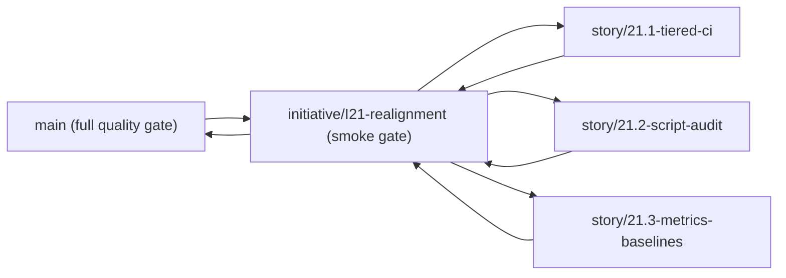

# Git Workflow

Reference for the tiered branch model, validation gates, PR checklists, and recovery guidance.

---

## 1. Branch Model

### 1.1 Stable Branch

`main` is the release-ready branch. Only initiative-integration PRs target `main`.

### 1.2 Initiative Branches

Long-lived initiative branches are created from `main` and collect related epics:

```bash
git checkout main
git pull
git checkout -b initiative/<id>-<slug>
```

Examples:

```bash
initiative/I21-realignment
initiative/I18-accessibility
```

### 1.3 Epic Branches

Epic branches are short-lived and always branch from their parent initiative branch:

```bash
git checkout initiative/<id>-<slug>
git pull
git checkout -b story/<epic-id>-<slug>
```

Examples:

```bash
story/21.1-tiered-ci
story/21.3-metrics-baselines
```

### 1.4 Topology



### 1.5 Test Tier By Boundary

| Merge boundary                | Branch target           | Required gate                                  |
| ----------------------------- | ----------------------- | ---------------------------------------------- |
| Epic PR                       | `initiative/*`          | local `pnpm test:smoke` before push            |
| Any PR (CI)                   | `main` / `initiative/*` | `ci.yml` `build-and-test` (`pnpm gates` + `pnpm test`) |
| Full app rehearsal            | before release          | `pnpm validate` (`validate.yml`)               |

---

## 2. Workflow

### 2.1 Epic Work

```bash
git checkout initiative/<id>-<slug>
git pull
git checkout -b story/<epic-id>-<slug>
```

Push the epic branch and open a PR against the initiative branch:

```bash
gh pr create \
  --title "<type>(<scope>): <summary> [Epic X.Y]" \
  --base initiative/<id>-<slug> \
  --body "<what changed, why, how validated>"
gh pr merge --auto --squash
```

### 2.2 Initiative Integration

When the initiative branch is ready:

```bash
gh pr create \
  --title "<type>(<scope>): <summary> [Initiative IXX]" \
  --base main \
  --head initiative/<id>-<slug> \
  --body "<what changed, why, how validated>"
gh pr merge --auto --squash
```

### 2.3 Trivial Direct-to-Main Exceptions

Direct commits to `main` are reserved for:

- single-file documentation typo fixes
- emergency release follow-ups explicitly approved by a human

All feature, fix, refactor, CI, or tooling work uses the initiative/epic model.

---

## 3. Validation Gates

### 3.1 Local Discipline

No git hooks are installed in this repo, so these are run by hand — run them before pushing rather than relying on a hook:

| When              | Command                     |
| ----------------- | --------------------------- |
| Before every push | `pnpm test:smoke` (fast) or `pnpm check` (full) |

### 3.2 Smoke Gate

`pnpm test:smoke` is the fast local gate: `pnpm lint:boundary` + `pnpm typecheck`. Use it while iterating; run `pnpm check` before handoff.

### 3.3 CI Gate

Every push to `main` and every pull request runs `.github/workflows/ci.yml` job `build-and-test`:

- `pnpm gates` — tiered quality-gate registry (fails closed)
- `pnpm test` — core unit + cloud/net + repo tooling tests

The whole-application harness `pnpm validate` runs in `.github/workflows/validate.yml` (desktop/cloud layers self-skip without a display or AWS creds). See `docs/development/VALIDATION.md`.

### 3.4 Manual Checks

Run the domain-appropriate commands before opening a PR:

| When                             | Command             |
| -------------------------------- | ------------------- |
| Pre-handoff full gate            | `pnpm check`        |
| Whole-app rehearsal              | `pnpm validate`     |
| UI routes or interaction changes | `pnpm e2e`          |
| Accessibility-affecting changes  | `pnpm a11y:gate`    |
| Electron desktop changes         | `pnpm desktop:build`|

---

## 4. Branch Protection Setup

### 4.1 `main`

GitHub Settings -> Branches -> Add rule:

- Branch name pattern: `main`
- Require a pull request before merging: enabled
- Require status checks to pass before merging: enabled
- Required checks:
  - `build-and-test`
- Require branches to be up to date before merging: enabled
- Do not allow bypassing the above settings
- Allow force pushes: disabled
- Allow deletions: disabled

### 4.2 `initiative/*`

GitHub Settings -> Branches -> Add rule:

- Branch name pattern: `initiative/*`
- Require a pull request before merging: enabled
- Require status checks to pass before merging: enabled
- Required checks:
  - `build-and-test`
- Require branches to be up to date before merging: enabled
- Do not allow bypassing the above settings
- Allow force pushes: disabled
- Allow deletions: disabled

### 4.3 Auto-Merge Settings

Repository settings must enable:

- squash merging
- auto-merge
- automatically delete head branches

---

## 5. Pull Requests

### 5.1 Titles

```text
<type>(<scope>): <imperative summary> [Epic X.Y]
```

### 5.2 PR Body

State what changed, why, and how it was validated (which of `check` / `validate` / `e2e` / `a11y:gate` you ran).

### 5.3 Merge Policy

- Every PR merges only after CI `build-and-test` is green.
- Squash merge is the default strategy.

---

## 6. Recovery Guidance

| Situation                                | Action                                                                      |
| ---------------------------------------- | --------------------------------------------------------------------------- |
| Smoke fails on epic PR                   | Fix on the same `story/*` branch and push again                             |
| Full gate fails on initiative PR         | Fix on the same initiative branch or merge the needed epic fix first        |
| Initiative branch drifts behind `main` | Rebase or merge `main`, then re-run `pnpm check`                          |
| Merged PR requires rollback              | Human decision only; use a new `git revert <sha>` PR                        |
| Broken local commit not yet pushed       | `git commit --amend` is acceptable only for the immediately previous commit |

---

## 7. CI Workflows

- `.github/workflows/ci.yml` — `build-and-test` (`pnpm gates` + `pnpm test`) on every push to `main` and every PR; concurrency cancels superseded runs.
- `.github/workflows/validate.yml` — whole-app `pnpm validate` harness (desktop/cloud layers self-skip without a display or AWS creds).
- `.github/workflows/deploy.yml` — AWS cloud deploy (OIDC; path-filtered; skips cleanly when unconfigured).
- `.github/workflows/release.yml` — desktop release packaging.

---

## 8. Reference

- `docs/development/DEVELOPMENT.md`
- `docs/development/SCRIPTS.md`
- `docs/development/VALIDATION.md`
- `.github/workflows/ci.yml`
- `.github/workflows/validate.yml`
- `CLAUDE.md`
