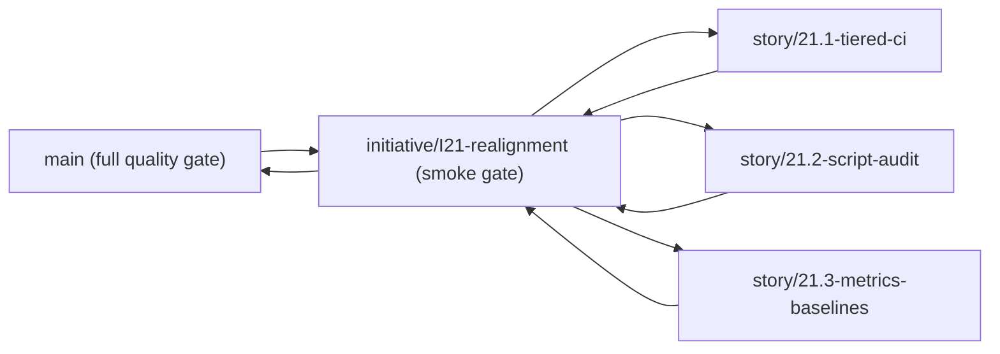

# Git Workflow

Reference for the tiered branch model, validation gates, PR checklists, and recovery guidance.

---

## 1. Branch Model

### 1.1 Stable Branch

`main` is the release-ready branch. Only initiative-integration PRs target `main`.

### 1.2 Initiative Branches

Long-lived initiative branches are created from `main` and collect related epics:

```bash
git checkout main
git pull
git checkout -b initiative/<id>-<slug>
```

Examples:

```bash
initiative/I21-realignment
initiative/I18-accessibility
```

### 1.3 Epic Branches

Epic branches are short-lived and always branch from their parent initiative branch:

```bash
git checkout initiative/<id>-<slug>
git pull
git checkout -b story/<epic-id>-<slug>
```

Examples:

```bash
story/21.1-tiered-ci
story/21.3-metrics-baselines
```

### 1.4 Topology



### 1.5 Test Tier By Boundary

| Merge boundary                | Branch target           | Required gate             |
| ----------------------------- | ----------------------- | ------------------------- |
| Epic PR                       | `initiative/*`          | `smoke`                   |
| Initiative PR                 | `main`                | `quality`                 |
| Release / scheduled workflows | release + schedule refs | domain-specific workflows |

---

## 2. Workflow

### 2.1 Epic Work

```bash
git checkout initiative/<id>-<slug>
git pull
git checkout -b story/<epic-id>-<slug>
```

Push the epic branch and open a PR against the initiative branch:

```bash
gh pr create \
  --title "<type>(<scope>): <summary> [Epic X.Y]" \
  --base initiative/<id>-<slug> \
  --body "$(cat .github/pull_request_template.md)"
gh pr merge --auto --squash
```

### 2.2 Initiative Integration

When the initiative branch is ready:

```bash
gh pr create \
  --title "<type>(<scope>): <summary> [Initiative IXX]" \
  --base main \
  --head initiative/<id>-<slug> \
  --body "$(cat .github/pull_request_template.md)"
gh pr merge --auto --squash
```

### 2.3 Trivial Direct-to-Main Exceptions

Direct commits to `main` are reserved for:

- single-file documentation typo fixes
- emergency release follow-ups explicitly approved by a human

All feature, fix, refactor, CI, or tooling work uses the initiative/epic model.

---

## 3. Validation Gates

### 3.1 Local Hooks

| Hook       | Trigger            | Command                          |
| ---------- | ------------------ | -------------------------------- |
| pre-commit | every `git commit` | `pnpm lint && pnpm format:check` |
| pre-push   | every `git push`   | `pnpm check`                     |

Never bypass hooks with `--no-verify`.

### 3.2 Smoke Gate

`pnpm test:smoke` is the fast gate for epic PRs. It includes:

- `pnpm format:check`
- `pnpm lint`
- `pnpm typecheck`
- `pnpm test:critical`

`pnpm test:critical` is the curated regression slice for storage, session-state, navigation, and boundary-rule coverage.

### 3.3 Full Quality Gate

PRs targeting `main` must pass:

- `quality-core`
- `docs-validation`
- `desktop-e2e-critical`
- `desktop-e2e-accessibility`
- `metrics-report`
- `commitlint`

### 3.4 Manual Checks

Run the domain-appropriate commands before opening a PR:

| When                             | Command              |
| -------------------------------- | -------------------- |
| Fast local confidence            | `pnpm audit:quick`   |
| Full local quality rehearsal     | `pnpm audit:full`    |
| UI routes or interaction changes | `pnpm test:e2e`      |
| Electron or MCP runtime changes  | `pnpm desktop:build` |
| MCP entrypoint or tool changes   | `pnpm mcp:build`     |

---

## 4. Branch Protection Setup

### 4.1 `main`

GitHub Settings -> Branches -> Add rule:

- Branch name pattern: `main`
- Require a pull request before merging: enabled
- Require status checks to pass before merging: enabled
- Required checks:
  - `quality`
  - `commitlint`
- Require branches to be up to date before merging: enabled
- Do not allow bypassing the above settings
- Allow force pushes: disabled
- Allow deletions: disabled

### 4.2 `initiative/*`

GitHub Settings -> Branches -> Add rule:

- Branch name pattern: `initiative/*`
- Require a pull request before merging: enabled
- Require status checks to pass before merging: enabled
- Required checks:
  - `smoke`
  - `commitlint`
- Require branches to be up to date before merging: enabled
- Do not allow bypassing the above settings
- Allow force pushes: disabled
- Allow deletions: disabled

### 4.3 Auto-Merge Settings

Repository settings must enable:

- squash merging
- auto-merge
- automatically delete head branches

---

## 5. Pull Requests

### 5.1 Titles

```text
<type>(<scope>): <imperative summary> [Epic X.Y]
```

### 5.2 Template Use

`.github/pull_request_template.md` contains both checklists:

- epic PRs complete the smoke/acceptance checklist
- initiative PRs complete the full-quality/performance/docs checklist

### 5.3 Merge Policy

- Epic PRs merge into `initiative/*` only after `smoke` is green.
- Initiative PRs merge into `main` only after `quality` is green.
- Squash merge is the default strategy for both tiers.

---

## 6. Recovery Guidance

| Situation                                | Action                                                                      |
| ---------------------------------------- | --------------------------------------------------------------------------- |
| Smoke fails on epic PR                   | Fix on the same `story/*` branch and push again                             |
| Full gate fails on initiative PR         | Fix on the same initiative branch or merge the needed epic fix first        |
| Initiative branch drifts behind `main` | Rebase or merge `main`, then re-run `pnpm audit:full`                     |
| Merged PR requires rollback              | Human decision only; use a new `git revert <sha>` PR                        |
| Broken local commit not yet pushed       | `git commit --amend` is acceptable only for the immediately previous commit |

---

## 7. End-to-End Validation Notes

Validated assumptions for the tiered model:

- `ci-smoke.yml` is scoped to `initiative/*`, so epic PRs do not pay for desktop E2E or metric capture.
- `ci.yml` is scoped to `main`, so initiative integration gets the full quality gate plus metric comparison.
- Concurrency groups are separated by tier to cancel superseded smoke runs without interrupting full-quality runs.
- The PR template supports both tiers in a single file, which avoids drift between multiple templates.

---

## 8. Reference

- `docs/development/DEVELOPMENT.md`
- `docs/development/SCRIPTS.md`
- `docs/development/TESTING.md`
- `.github/workflows/ci-smoke.yml`
- `.github/workflows/ci.yml`
- `.github/pull_request_template.md`
- `CLAUDE.md`
